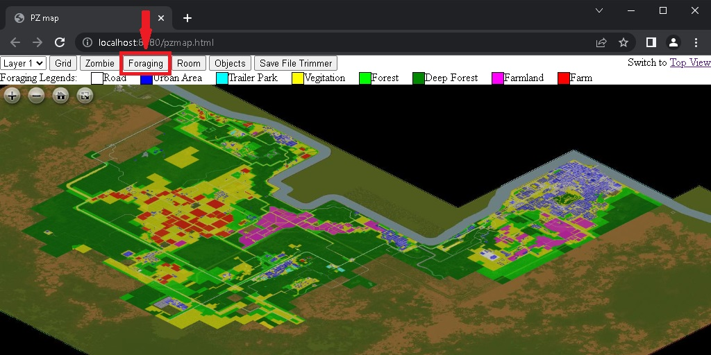

# pzmap2dzi
pzmap2dzi is a command-line tool running on Windows to convert Project Zomboid map data into [Deep Zoom format](https://en.wikipedia.org/wiki/Deep_Zoom).

# Features

- Supports both python 2 and python 3
- HTML viewer for viewing the generated Deep Zoom image.
- Various plant rendering configurations (snow, flower, tree size, etc.).
- Supports multi-thread acceleration
- Supports resuming from a breakpoint
- Supports map grid and room info rendering
- Supports zombie heatmap rendering
- Supports foraging zones rendering
- Supports isometric view and top view rendering
- Supports map objects rendering (car spawn zones, special zombie spawn zones, map story zones)
- Supports game version 41.72 (unstable)

# Requirement
- The full output size of isometric map for game version 41.72 (unstable) is around 230GB (or 1.3TB with lossless png format) and consists of 2.2M files. Make sure you output to a hard drive has enough free space.
- The rending process will take a very long time, so it's better to have a high-performance CPU, hard drive, and large memory. 
    - The full rending took around 12 hours (or 22 hours with lossless png format) on an AMD 3700X with 64GB DDR4 2133 memory and a SATA3 mechanical hard drive using a 16 thread setting
- If you choose to render only top view map, output size will be around 250MB and can be done around 2 hours.

# How to run

1. Install [Python](https://www.python.org/downloads/)
2. Clone or download the project
3. Install requirements

   - If your python version is 2.7, install VCForPython27 first. You can find it [here](https://web.archive.org/web/20210106040224/https://download.microsoft.com/download/7/9/6/796EF2E4-801B-4FC4-AB28-B59FBF6D907B/VCForPython27.msi) or [here](https://github.com/reider-roque/sulley-win-installer/blob/master/VCForPython27.msi)
   
   - run `install_requirements.bat`
4. Update variables in the `config.txt` file
   - Change the `pz_path` variable to contain the correct path where your ProjectZomboid located on your computer
   - Change the `out_path` variable to contain the desired output path
5. Run the tool

   Run `run.bat` to render all isometric and top view maps

   Or run `run_top_view_only.bat` to render only top view maps

# Change rendering configurations
- Change thread numbers (default is 16 threads)
    - In the `scripts/` folder, you can edit the starter command in the following files
    ```
    unpack_texture.bat
    render_base.bat
    render_base_top.bat
    render_foraging.bat
    render_foraging_top.bat
    render_grid.bat
    render_grid_top.bat
    render_objects.bat
    render_room.bat
    render_zombie.bat
    render_zombie_top.bat
    
    ```
    - Change `-m 16` to `-m 4` to use only four threads.
- Do not render grid and room info
    - Remove the calling of `render_grid.bat` and `render_room.bat` from `run.bat`
- Do not render zombie heatmap
    - Remove the calling of `render_zombie.bat` from `run.bat`
- Do not render foraging zones
    - Remove the calling of `render_foraging.bat` from `run.bat`
- Do not render top view map
    - Remove the calling of `render_zombie_top.bat` and `render_base_top.bat` from `run.bat`
- Config a hotkey to elegantly stop rendering at a breakpoint so you can resume later
    - Similar to the config of thread numbers, add `-s <hotkey>` to starter commands
        - For example, `-s "<f9>"` make the rendering process stop when you hit F9
    - To resume, run `run.bat` again
- Change base layer file format
    - Edit `scripts/render_base.bat`
    - Change `--layer0-fmt jpg` to `--layer0-fmt png` to use lossless png format for base layer

# How to start the HTML viewer
After the rendering, you get an `html` folder in your output path.
```
html
├── base/
├── base_top/
├── foraging/
├── foraging_top/
├── grid/
├── grid_top/
├── objects/
├── openseadragon/
├── room/
├── zombie/
├── zombie_top/
├─ chrome_allow_file(need close chrome first).bat
├─ chrome_no_sicurity.bat
├─ pzmap.html
├─ pzmap_top.html
└─ run_server.bat
```

Directly open `pzmap.html` will NOT work, as the Cross-Origin Resource Sharing (CORS) Policies will refuse to load Deep Zoom tiles from your locale disk by default.

There are two ways to bypass CORS:
1. Start a server and host your files on your drive
    - run `run_server.bat`
    - Afterwards, you can open `http://localhost:8880/pzmap.html` to view the image
2. If you are using Google Chrome with the default install path, you can do one of the followings:
    - open `pzmap.html` in a standalone tab with all web security disabled.
        - To do this, run `chrome_no_sicurity.bat`
    - restart Chrome to allow locale HTML access to locale files.
        - To do this, you close all opening Chrome tabs
        - Then run `chrome_allow_file(need close chrome first).bat`

# How to use the HTML viewer
- To switch floors, use the button form `Layer0` to `Layer7` on top of the page
- To enable/disable the grid, use the `Grid` button
    - (Position of the grid will adjust according to the current floor)

    
- To enable/disable room info, use the `Room` button
    - (Display room info of the current floor)

    
- To enable/disable zombie heatmap, use the `Zombie` button

    

- To enable/disable foraging zones, use the `Foraging` button

    

- To switch between isometric view and top view, use the view switch link

    
