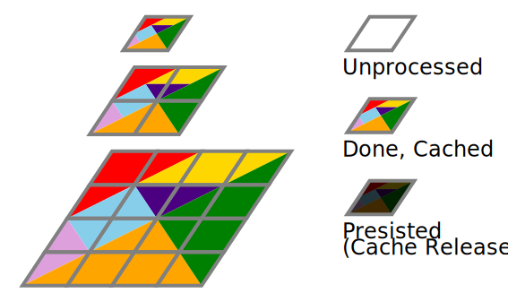

# Motivation

Enable multi-thread acceleration to improve rendering performance.

Cache rendered images to avoid redundant disk reads when generating upper-level thumbnails. The cache is discarded after thumbnail creation.

Increase locality for render threads by assigning each thread a compact sub-pyramid of tiles to render. This reduces per-thread memory usage and speeds up rendering by minimizing scattered memory access.

# Design

## Render Tiles in Z-Order to Increase Locality

In an ideal multi-worker (multi-thread) scenario, each thread renders a connected region of the map to increase locality, thereby reducing the number of source files read by concurrent workers. However, since texture distribution on the map is uneven, pre-allocating perfectly balanced regions to workers is challenging. Some workers may finish earlier and attempt to steal work from others, but we aim to maintain locality even after work-stealing.

To achieve this, we use [Z-Order curve](https://en.wikipedia.org/wiki/Z-order_curve) curve mapping to convert 2D tiles into a 1D index sequence. Consecutive indexes in this sequence correspond to spatially connected tiles on the 2D map with high probability. The sequence is divided into equal-length segments assigned to workers. When a worker finishes its segment, it steals half of the longest remaining unfinished segment from another worker. This balances workload while preserving locality.

## Use Shared Memory to Store Cached Images

Rendered images are stored directly in shared memory. After writing an image to disk, the shared memory is retained as a cache for subsequent thumbnail generation. This eliminates disk readbacks. For implementation details, see [shared_memory_image.py](/pzmap2dzi/shared_memory_image.py).

## Render in Topological Order

Initially, the renderer built the DZI pyramid level-by-level: it rendered the bottom level first, then generated upper-level thumbnails. This approach required reading rendered images back from disk for thumbnail generation, as the entire bottom level could not be cached in memory.

To resolve this, we adopted **topological order rendering**, which ensures only a small subset of tiles need to be cached for pending thumbnails. This completely eliminates disk readbacks. Below is an animated demonstration of the algorithm:

For code details, refer to the `TopologicalDziScheduler` class in [scheduling.py](/pzmap2dzi/scheduling.py).
